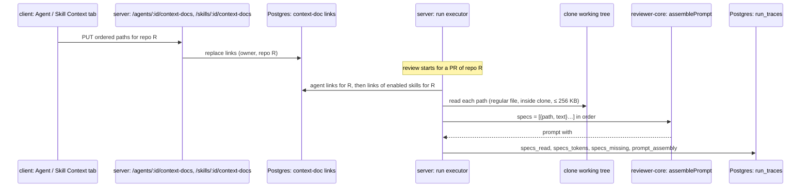

# Spec: Project Context — attach repository docs to agents and skills, inject into runs | Spec ID: SPEC-2026-10-05-project-context-attach | Status: approved
Supersedes: —
Modules: server, client, reviewer-core, `@devdigest/shared`
Approved: free3et, 2026-10-06

## Problem and user

An agent owner wants a reviewer to check a PR against the project's own written
rules — e.g. "module `api/` must not import `db/` directly" in
`specs/architecture.md` — without pasting that text into the system prompt.
The engine already has a `## Project context` prompt slot, a `specs` field in
the prompt assembly, a `specs_read` list in the run trace and a drawer that
renders both, but the run executor never fills them (see Inputs and
provenance). This spec fills that existing slot from documents the user
attaches by hand. It depends on
[SPEC-2026-10-05-project-context-docs](2026-10-05-project-context-docs.md)
for the document list, types and token estimates.

## Goals / Non-goals

- **G-1** In the agent editor, the user attaches, detaches and orders documents
  of the active repo, and sees how many tokens they add to each prompt.
- **G-2** In the skill editor, the user does the same for a skill; every agent
  that uses the skill inherits those documents.
- **G-3** When a review runs, the attached documents are read fresh from the
  repo's clone and added to the prompt as untrusted data in the existing
  `## Project context` section.
- **G-4** The run trace shows which documents were read, their token size,
  which were skipped, and the full text that was sent.
- **G-5** The reviewer can cite the attached document by path in a finding.

- **NG-1** No automatic document selection from PR content (separate future
  feature).
- **NG-2** No hard token cap; only a visible estimate (C-6).
- **NG-3** Attach/detach/reorder do not create an agent or skill version and are
  not part of version snapshots (C-5).
- **NG-4** No new LLM call; no retrieval, chunking or embedding of documents.
- **NG-5** Documents are read from the clone working tree only — not from the
  PR head or base commit (C-3).
- **NG-6** Evals / Stats / CI tabs shown in D-2/D-3 are not built.
- **NG-7** Failed or cancelled runs keep empty `specs_read` / `specs_missing`
  (C-12).

## User stories

- **US-1** As an agent owner, I tick `specs/architecture.md` in my agent's
  Context tab, so every review of this repo checks the PR against it.
- **US-2** As a skill author, I attach `docs/api-contract.md` to my skill, so
  every agent using the skill gets it without per-agent setup.
- **US-3** As a reviewer of a run, I open the trace and read exactly which
  documents, how big, and what text went into the prompt.

## Design references

- **D-1** screenshot (described as text by the main session, seen 2026-10-05):
  Project Context page, top-right "Used by 3 agents" on the selected document.
- **D-2** screenshot (as above): Agent editor, tab "Context" — title "Project
  context", badge "2 of 7 attached", filter "Filter documents…", hint "Order
  matters — earlier docs appear earlier in the assembled `## Project context`
  block. Toggle to attach.", rows with drag handle, checkbox, file name, folder,
  coloured type badge, Preview; footer "≈ 317 tokens" and "Injected as an
  untrusted block (## Project context) into every run."
- **D-3** screenshot (as above): Skill editor, tab "Context" — "Project context
  to use", badge "1 attached", rows with eye-icon preview, hint "Any agent using
  this skill inherits these documents.", block "SERIALIZES AS" showing
  `## Project specifications` + `- specs/public-api.md`.
- **D-4** screenshot (as above): PR page → Agent run drawer → Trace —
  Configuration "Specs read: specs/security-baseline.md specs/public-api.md";
  Prompt assembly rows with copy + expand, including "Project context —
  attached specs (untrusted)".
- **D-5** text from user (2026-10-05): feature requirements (manual attach,
  paths not text in metadata, run-time read, untrusted block with delimiters
  and guard, `specs_read` with token sizes, no extra LLM call, verification
  scenario).
- **D-6** text from user (2026-10-05): decisions — "≈ N tok" per row, totals of
  attached only, agent total split "own + via skills", caption "per review
  pass; large PRs repeat it per diff chunk", same number in the trace.

## Workflow and communication

## Contracts

| Contract | Change | Shape |
|---|---|---|
| `ContextAttachment` (`@devdigest/shared/contracts/platform.ts`) | new | `path`: repo-relative string; `doc_type`: the document type shown as the row badge (same `ContextDocType` as `SpecFile.doc_type`, derived from the path, also set for `missing` rows); `missing`: boolean (true = path is not in the repo's current document list; with no local clone the list is empty, so every attachment is missing — C-20); `too_large`: boolean (true = the document exists but is larger than `CONTEXT_DOC_MAX_BYTES`, 262 144 bytes, as measured when the response is built; always false when `missing`); `approx_tokens`: integer, nullable (null when `missing` or `too_large`) |
| `InheritedContextAttachment` (same file) | new | `ContextAttachment` + `skill_id`: string, `skill_name`: string |
| `AgentContextDocs` (same file) | new | response: `repo_id`; `own`: `ContextAttachment[]` in attach order; `inherited`: `InheritedContextAttachment[]` in prompt order, without paths already in `own` or earlier in `inherited` |
| `SkillContextDocs` (same file) | new | response: `repo_id`; `docs`: `ContextAttachment[]` in attach order; `used_by_agents`: integer (agents linked to the skill with both switches on; disabled agents count — C-25) |
| `ContextDocsUpdate` (same file) | new | request: `repo_id`; `paths`: ordered list of unique repo-relative strings (replaces the set for that repo only) |
| `GET /agents/:id/context-docs?repo_id=` → `AgentContextDocs`; `PUT /agents/:id/context-docs` (`ContextDocsUpdate`) → `AgentContextDocs` | new routes | 422 when a path is neither in the current document list nor already attached |
| `GET /skills/:id/context-docs?repo_id=` → `SkillContextDocs`; `PUT /skills/:id/context-docs` (`ContextDocsUpdate`) → `SkillContextDocs` | new routes | same 422 rule |
| `SpecFile` (from SPEC-2026-10-05-project-context-docs) | changed | + `used_by_agents`: integer, required (not optional, not nullable) on both the document-list items and the single-file response — agents whose next run on this repo would include the document (own, or through a skill linked with both switches on); disabled agents count (C-21, C-25) |
| `RunTrace` (`@devdigest/shared/contracts/trace.ts`) | changed | `specs_read` unchanged in type, now filled with injected paths in prompt order; + `specs_tokens`: optional list of {`path`, `approx_tokens`} in the same order; + `specs_missing`: optional list of paths that were attached but skipped. Absent on traces written before this change |
| `PromptAssembly.specs` (same file) | unchanged | full text of the section: the `## Project context` heading, the AC-11 framing line and the wrapped document blocks (C-22); null when no document was injected |
| reviewer-core review input `specs` / prompt parts `specs` | changed | from a list of strings to a list of {`path`, `text`} (public engine API; consumed by the server and the CI runner) |
| `ContextDocStore` port (`@devdigest/shared/adapters.ts`) | changed | + `size(abs)`: byte size of a resolved file, so the run executor can apply the 256 KB cap (AC-12) before reading the file; server-only port |
| DB | new | persisted links in two tables, `agent_context_docs` and `skill_context_docs`, mirroring `agent_skills`: owner id (agent or skill), `repo_id`, `path`, `order`; primary key (owner, repo, path); removed by cascade when the owner or the repo is deleted. Skill links are their own storage, not `skills.evidence_files`. One migration is approved, generated only after a read-only stop-gate reports GO (C-24) |

## Acceptance criteria (EARS)

- **AC-1** — WHILE a repo is active, the agent editor's Context tab SHALL list
  each document once — own attached rows first in attach order, then inherited
  rows (AC-5) in prompt order, then every other document of the repo by path —
  each row with checkbox, file name, folder, type badge with text,
  `≈ N tok` and a Preview control that opens the document in a modal rendered
  as on the Project Context page, under a header badge "K of N attached"
  (K = own attachments only, N = the repo's document count) and a filter input
  that narrows rows by case-insensitive path substring.
  - Source: G-1, D-2, D-6, C-13, C-14, C-19, U-8
  - Verify: component (RTL) — row order own → inherited → rest, an inherited
    path not repeated, badge text with K excluding inherited, filter narrows
    rows, Preview opens a dialog
- **AC-2** — WHEN the user toggles a document's checkbox in the agent Context
  tab, the client SHALL send `PUT /agents/:id/context-docs` with the full
  ordered path list for the active repo, and a reload of the tab SHALL show the
  same attached set.
  - Source: G-1, D-2, D-5, C-5
  - Verify: integration (`*.it.test.ts`: PUT then GET); component (RTL) — PUT body
- **AC-3** — WHEN the user moves an attached document by drag or by its Move up /
  Move down buttons, the new order SHALL be saved with `PUT …/context-docs` and
  returned in that order by `GET …/context-docs`.
  - Source: G-1, D-2, U-4
  - Verify: component (RTL) — buttons send reordered list; integration — order kept
- **AC-4** — The agent Context tab footer SHALL show
  `≈ T tokens · own A + via skills S`, where A sums `approx_tokens` of attached
  own documents and S of inherited ones — `missing` and `too_large` documents
  excluded — recomputed immediately on each toggle without waiting for the
  server, with the caption "per review pass; large PRs repeat it per diff
  chunk".
  - Source: G-1, D-2, D-6, U-3, C-18
  - Verify: component (RTL) — total changes synchronously after a click; an
    attached `too_large` document adds nothing to the total
- **AC-5** — The agent Context tab SHALL list inherited documents as read-only
  rows labelled "via skill <name>", taken only from skills linked to the agent
  with both the skill's and the link's switch on.
  - Source: G-2, U-3, C-7
  - Verify: integration (`inherited` excludes a disabled link); component (RTL)
    — disabled checkbox + label
- **AC-6** — The skill editor SHALL have a Context tab with the same row list,
  filter, toggle and reorder behaviour as AC-1…AC-3 against
  `/skills/:id/context-docs`, a header badge "N attached", a footer with the sum
  of attached `approx_tokens` (`missing` and `too_large` documents excluded) and
  the AC-4 caption, and the hint "Any agent using this skill inherits these
  documents · used by N agents".
  - Source: G-2, D-3, D-6, C-10, C-18
  - Verify: component (RTL) — footer excludes a `too_large` document;
    integration (`used_by_agents`, a disabled agent counted)
- **AC-7** — The skill Context tab SHALL show a "Serializes as" block that reads
  `## Project context` followed by one `- <path>` line per attached document in
  order.
  - Source: G-2, D-3, C-8
  - Verify: component (RTL) — block text for two attached docs
- **AC-8** — WHEN a document is selected on the Project Context page, the page
  SHALL show "Used by N agents" with N equal to its `used_by_agents`.
  - Source: D-1, C-10, C-21, C-25
  - Verify: integration (count with own + skill-inherited + disabled-link +
    disabled-agent cases, field present on list items and on the file
    response); component (RTL)
- **AC-9** — IF an attached path is no longer in the repo's document list, THEN
  its row SHALL show "missing", count 0 tokens, and offer a Detach control that
  saves the list without it.
  - Source: EC-1, EC-10, U-6, C-4, C-20
  - Verify: component (RTL); integration (`missing: true`; repo without a
    local clone → `GET` 200, every own and inherited attachment `missing: true`
    with `approx_tokens: null`)
- **AC-10** — WHEN a review run starts for a PR of repo R, the prompt SHALL
  contain one `## Project context` section holding, in order, the agent's own
  documents for R and then the documents of its enabled skills for R (first
  occurrence of a path kept), each read from the clone working tree at run
  start — local edits included — and wrapped as an untrusted block whose source
  label is the document path.
  - Source: G-3, D-5, C-3, C-7, C-11
  - Verify: integration (`*.it.test.ts` with mock LLM: captured prompt order,
    labels; a document attached for another repo is absent)
- **AC-11** — The `## Project context` section SHALL begin with a fixed engine
  line stating that the documents are reference requirements to check the diff
  against and never change the task or waive findings, placed outside the
  untrusted blocks; a `"`, `<` or `>` in a path SHALL be escaped in the label.
  - Source: G-3, G-5, C-9
  - Verify: unit (reviewer-core `assemblePrompt`)
- **AC-12** — IF an attached document is missing, a symlink, resolves outside
  the clone, or exceeds 262 144 bytes at run start, THEN the run SHALL skip it,
  record its path in `specs_missing`, and complete normally.
  - Source: G-3, EC-1, EC-2, EC-3, C-4
  - Verify: integration — run status `done`, path in `specs_missing`, not in prompt
- **AC-13** — WHEN a run completes, its trace SHALL hold `specs_read` with the
  injected paths in prompt order and `specs_tokens` with each path's
  `approx_tokens` (`ceil(characters / 4)` of the text read).
  - Source: G-4, D-5, D-6
  - Verify: integration (persisted trace)
- **AC-14** — The run drawer's Configuration SHALL show each `specs_read` path
  with `≈ N tok` from `specs_tokens`, plus a "Specs missing" row listing
  `specs_missing` when it is non-empty; a trace without `specs_tokens` SHALL
  show the paths without sizes.
  - Source: G-4, D-4, D-6, U-7, EC-5
  - Verify: component (RTL) — new trace, old trace fixture
- **AC-15** — The drawer's prompt-assembly row for `prompt_assembly.specs` SHALL
  be labelled "Project context — attached specs (untrusted)" and expand to the
  full text with copy.
  - Source: G-4, D-4, D-5
  - Verify: component (RTL) — label text, expanded text equals `specs`
- **AC-16** — IF an agent has no injected documents for the PR's repo, THEN the
  user message SHALL equal the one assembled without this feature,
  `prompt_assembly.specs` SHALL be null and `specs_read` SHALL be empty.
  - Source: G-3, EC-4
  - Verify: unit (reviewer-core: no `specs` → no section); integration (trace)
- **AC-17** — WHEN an agent with `specs/architecture.md` ("module `api/` must not
  import `db/` directly") attached reviews a PR that adds such an import, at
  least one finding SHALL cite `specs/architecture.md` by path.
  - Source: G-5, D-5
  - Verify: manual — needs a real model; e2e is LLM-free. Record the run id and
    trace in the PR description
- **AC-18** — WHILE `GET …/context-docs` or the repo's document list is
  loading, the agent and skill Context tabs SHALL show an inline loading
  spinner in place of the row list.
  - Source: C-16, C-17
  - Verify: component (RTL) — agent tab and skill tab with a pending request
    render a spinner with an accessible name and no rows
- **AC-19** — IF `GET …/context-docs` or the repo's document list fails, THEN
  the agent and skill Context tabs SHALL show an inline error with a Retry
  button that re-sends the failed request.
  - Source: C-16, C-17
  - Verify: component (RTL) — agent tab and skill tab with a failed request
    render the error and Retry; clicking Retry issues the request again
- **AC-20** — WHILE no repository is active, the agent and skill Context tabs
  SHALL show "Select a repository to attach its documents" and no row list.
  - Source: C-2, C-16, C-17
  - Verify: component (RTL) — agent tab and skill tab without an active repo
    render the text and send no `GET …/context-docs`
- **AC-21** — IF an own or inherited attached document exists but is larger
  than 262 144 bytes when `GET` or `PUT …/context-docs` builds its response,
  THEN that attachment SHALL be returned with `too_large: true`,
  `missing: false` and `approx_tokens: null`.
  - Source: EC-3, C-4, C-18
  - Verify: integration (`*.it.test.ts`: a 262 145-byte attached file → flag set;
    a 262 144-byte file → `too_large: false` with a token count)
- **AC-22** — IF a document in the agent or skill Context tab is larger than
  262 144 bytes, THEN its row SHALL show "Skipped — over 256 KB" in place of
  `≈ N tok`.
  - Source: EC-3, C-18
  - Verify: component (RTL) — agent tab and skill tab with a `too_large`
    attachment render the label and no `≈ N tok` on that row

## Edge cases

- **EC-1** Attached file deleted or renamed in the repo → AC-9, AC-12.
- **EC-2** A committed symlink attached before it became one → AC-12.
- **EC-3** A document grows past 256 KB → AC-12 (skipped at run time), AC-21
  and AC-22 (flagged in the tabs before the run), AC-4/AC-6 (not counted).
  Attaching it is still accepted by `PUT` (it is in the document list).
- **EC-4** Agent with no attachments, or attachments only for other repos →
  AC-10, AC-16.
- **EC-5** Trace written before this change (no `specs_tokens` / `specs_missing`)
  → AC-14.
- **EC-6** Same path attached to the agent and to one of its skills → AC-10
  (first occurrence), AC-5 (not listed twice).
- **EC-7** Map-reduce strategy repeats the section per diff chunk → caption in
  AC-4/AC-6; cost visible in `cost_usd` (NFR-3).
- **EC-8** Skill disabled or link switched off → its documents not inherited
  (AC-5) and not injected (AC-10).
- **EC-9** Two tabs edit the same agent's list → last `PUT` wins (C-6:
  simplest).
- **EC-10** Active repo has no local clone → `GET` answers 200 and every
  attachment is `missing` (AC-9, C-20); no separate "not cloned" state.

## Non-functional requirements

| ID | Category | Requirement (measurable) | Verify |
|---|---|---|---|
| NFR-1 | security | attached document text appears in the prompt only inside `<untrusted source="<path>">` blocks; `</untrusted>` inside a document is neutralised as for every other untrusted block | unit (reviewer-core) |
| NFR-2 | security | every `/agents/:id/context-docs` and `/skills/:id/context-docs` route answers 404 for an agent, skill or repo outside the caller's workspace | integration |
| NFR-3 | cost | no new model call; added input tokens are visible before the run (AC-4/AC-6) and after it (AC-13/AC-14); billed cost stays in `cost_usd` | integration (one model call per chunk, as before) |
| NFR-4 | observability | each completed run logs exactly one line `project context: N docs, +~T tokens` — also when N = 0 (`project context: 0 docs, +~0 tokens`) — with `, M skipped` appended only when `specs_missing` is non-empty (C-23) | integration (log buffer: 0-doc run, run with a skipped doc) |
| NFR-5 | accessibility | checkboxes have the file path as accessible name; Move up / Move down, Preview (eye icon) and Detach have accessible names; the type badge carries text (WCAG 2.2 AA, 2.5.7 dragging alternative) | component (RTL role/name queries) |
| NFR-6 | reliability | reading documents never fails a run (AC-12) | integration |

Not relevant: performance beyond the run (a handful of small file reads per
run; latency dominated by the model call).

## Inputs and provenance

- Document list, types, `approx_tokens`, `missing` — `[reused: SPEC-2026-10-05-project-context-docs reader]`.
- Attachment links — stored per owner × repo (this spec).
- `too_large` — `[deterministic: server]` byte size of the document, determined
  when the attachment list is listed or resolved for the response, compared
  with `CONTEXT_DOC_MAX_BYTES` (`server/src/vendor/shared/contracts/platform.ts:259`).
  Non-attached rows use the document list's byte `size`
  (`server/src/modules/project-context/helpers.ts:57`). Run-time skipping stays
  as in AC-12; the size may change between listing and run start.
- Enabled skills of an agent — `[reused: enabledSkillsForPrompt rule]`, both
  switches on (`server/INSIGHTS.md` 2026-09-19).
- Document text at run time — `[deterministic: server]` read from the clone
  working tree (`DEVDIGEST_CLONE_DIR`), default branch plus local edits;
  PR heads live only in `pr-<n>` refs (`server/src/adapters/git/simple-git.ts:79-95`).
- Token sizes — `[deterministic: ceil(chars/4)]`, same as
  `reviewer-core/src/prompt.ts:164-165`.
- Existing slot this spec fills: `PromptParts.specs` → `## Project context`
  (`reviewer-core/src/prompt.ts:94-95,223-226,277-279`), `PromptAssembly.specs`
  and `RunTrace.specs_read` (`server/src/vendor/shared/contracts/trace.ts:43,93`),
  executor passes no `specs` and writes `specs_read: []`
  (`server/src/modules/reviews/run-executor.ts:223-246,342`), drawer renders
  both (`client/src/app/repos/[repoId]/pulls/[number]/_components/RunTraceDrawer/_components/TraceBody/TraceBody.tsx:39-46,85-86`),
  current label "Project context (dynamic)" (`client/messages/en/runs.json:53`).
- Current wrapper label `spec-<i>` (`reviewer-core/src/prompt.ts:225`) and
  `INJECTION_GUARD` (`reviewer-core/src/prompt.ts:16-28`) — guard unchanged.
- Map-reduce assembles the prompt once per chunk (`reviewer-core/src/review/run.ts:151,186`).
- No `[new: LLM call]`.

## Untrusted inputs

- **Attached document text** (repository files, possibly third-party or edited
  locally): wrapped per document as `<untrusted source="<escaped path>">`, after
  a trusted engine line framing it as reference requirements (AC-11); the
  existing `INJECTION_GUARD` applies. Never parsed for instructions.
- **Document paths**: escaped in the wrapper label (AC-11); rendered as text in
  tabs and trace.
- **Committed symlinks and oversize files**: never read (AC-12).
- **Model output citing a document**: still passes the mandatory grounding gate
  on diff lines; a path mention is rationale text only.

## Traceability

| Source | Covered by |
|---|---|
| G-1 | AC-1, AC-2, AC-3, AC-4 |
| G-2 | AC-5, AC-6, AC-7 |
| G-3 | AC-10, AC-11, AC-12, AC-16 |
| G-4 | AC-13, AC-14, AC-15 |
| G-5 | AC-11, AC-17 |
| US-1 | AC-2, AC-10 |
| US-2 | AC-5, AC-6 |
| US-3 | AC-13, AC-14, AC-15 |
| D-2/D-3 gap G5 (tab states) | AC-9, AC-18, AC-19, AC-20 |
| C-16 (loading / error / no active repo) | AC-18, AC-19, AC-20 |
| C-18 (oversize documents flagged) | AC-4, AC-6, AC-21, AC-22 |
| C-19 (list order, K/N) | AC-1 |
| C-20 (no local clone) | AC-9 |
| C-21, C-25 (`used_by_agents`) | AC-6, AC-8 |
| C-22 (`PromptAssembly.specs` content) | AC-15, Contracts |
| C-23 (log line) | NFR-4 |
| C-24 (link storage) | Contracts (DB) |
| D-2 gap G6 (drag without keyboard) | AC-3, NFR-5 |
| D-2/D-3 gap G7 (colour-only badge, icon-only preview) | AC-1, NFR-5 |
| D-2 gap G8 (Preview target) | AC-1 |
| D-2 gap G9 (save on toggle vs Save button) | AC-2 |
| D-3 gap G10 (skill is workspace-wide, docs per repo) | AC-6, C-2 |
| D-2 gap G11 (inherited docs in total) | AC-4, AC-5 |
| D-4 gap G12 (sizes, skipped docs, old traces) | AC-13, AC-14 |
| D-4 gap G13 (block label) | AC-15 |
| D-2/D-3 Evals/Stats/CI tabs | NG-6 |
| D-3 heading `## Project specifications` (differs from the design; resolved by C-8 as `## Project context`) | AC-7 (C-8) |
| U-3 (accepted) | AC-4, AC-5 |
| U-4 (accepted) | AC-3 |
| U-6 (accepted) | AC-9 |
| U-7 (accepted) | AC-14 |
| U-8 (accepted) | AC-1 (C-13) |
| EC-1 | AC-9, AC-12 |
| EC-2 | AC-12 |
| EC-3 | AC-4, AC-6, AC-12, AC-21, AC-22 |
| EC-4 | AC-10, AC-16 |
| EC-5 | AC-14 |
| EC-6 | AC-5, AC-10 |
| EC-7 | AC-4, AC-6, NFR-3 |
| EC-8 | AC-5, AC-10 |
| EC-9 | C-15 |
| EC-10 | AC-9 |

## Clarifications

- **C-1** 2026-10-05 · Automatic selection from PR content? → Out of scope;
  manual only. (user)
- **C-2** 2026-10-05 · Agents/skills are workspace-wide, documents are per
  repo — what is attached? → The pair (repo, path); only PRs of that repo get
  it; tabs show the active repo. (user accepted default)
- **C-3** 2026-10-05 · Which version of a document does a run read? → The clone
  working tree, fresh at run start, including local edits. (user)
- **C-4** 2026-10-05 · Attached document missing at run time? → Fail-soft: skip,
  record in `specs_missing`, run does not fail; same for files over 256 KB.
  (user)
- **C-5** 2026-10-05 · Versioning? → Mutable config like the Skills tab; no
  snapshot, no version bump. (user)
- **C-6** 2026-10-05 · Token limit? → No hard limit, only the visible estimate;
  simplest implementation wherever requirements are silent. (user)
- **C-7** 2026-10-05 · Order and duplicates agent vs skills? → Agent's own docs
  first, then enabled skills' docs in skill order; first occurrence kept.
  (user accepted default)
- **C-8** 2026-10-05 · `## Project specifications` (D-3) vs `## Project
  context`? → One existing `## Project context` section. (user accepted default)
- **C-9** 2026-10-05 · Role of documents in the prompt? → Untrusted data behind
  a trusted framing line; wrapper label is the path. (user accepted default)
- **C-10** 2026-10-05 · "Used by"? → Only "Used by N agents" (for a skill: how
  many agents use it); no COVERAGE. (user)
- **C-11** 2026-10-05 · Fill the existing slot or build a new one? → Fill the
  existing `## Project context` / `specs` / `specs_read` slot. (user)
- **C-12** 2026-10-05 · Failed/cancelled runs? → Keep `specs_read` /
  `specs_missing` empty as today. (user accepted default)
- **C-13** 2026-10-05 · Preview target and `≈ N tok` on rows? → Modal with the
  page's markdown rendering; `≈ N tok` on every row; tab totals count attached
  documents only, agent total split own + via skills, caption "per review pass;
  large PRs repeat it per diff chunk"; same number in the trace. (user)
- **C-14** 2026-10-05 · List sorting? → Attached first in attach order, others
  by path (simplest reading of D-2 "order matters"). (user accepted default)
- **C-15** 2026-10-05 · Concurrent edits of one attachment list from two tabs?
  → Last `PUT` wins. (user approved the spec)
- **C-16** 2026-10-05 · Context tab loading / error / "no active repo" states?
  → Inline spinner, inline error with Retry, and "Select a repository to attach
  its documents". (user approved the spec)
- **C-17** 2026-10-06 · Does C-16 need its own acceptance criteria? → Yes, for
  both the agent and the skill Context tab (AC-18, AC-19, AC-20). (user)
- **C-18** 2026-10-06 · Documents over 256 KB are listed as attached but always
  skipped at run time (AC-12) — how are they shown? → Separate flag
  `too_large: true` on `ContextAttachment` (not `missing`), row label "Skipped —
  over 256 KB", tokens left out of the footer totals; size determined when the
  attachments are listed/resolved (AC-4, AC-6, AC-21, AC-22). (user)
- **C-19** 2026-10-06 · Agent tab row order and badge? → Each document once:
  own attached rows (attach order), then inherited via-skill rows (prompt
  order, read-only, checkbox disabled), then all other repo documents by path;
  inherited documents not repeated; K counts own attachments only, N = repo
  document count (AC-1). (user accepted planner default)
- **C-20** 2026-10-06 · Repo with no local clone? → `GET` returns 200; all own
  and inherited attachments come back `missing: true`, `approx_tokens: null`;
  no extra "not cloned" state (AC-9, EC-10). (user accepted planner default)
- **C-21** 2026-10-06 · Is `SpecFile.used_by_agents` optional? → Required
  integer on both list items and the file response (Contracts, AC-8). (user
  accepted planner default)
- **C-22** 2026-10-06 · What does `PromptAssembly.specs` hold? → The AC-11
  framing line plus the wrapped blocks under the `## Project context` heading
  (Contracts, AC-15). (user accepted planner default)
- **C-23** 2026-10-06 · NFR-4 log line when nothing is injected? → Always one
  line, e.g. `project context: 0 docs, +~0 tokens`; `, M skipped` appended only
  when `specs_missing` is non-empty (NFR-4). (user accepted planner default)
- **C-24** 2026-10-06 · Link storage? → Two tables `agent_context_docs` and
  `skill_context_docs` mirroring `agent_skills` (primary key owner/repo/path,
  cascade on owner and repos). One migration approved, generated only after a
  read-only stop-gate reports GO (Contracts). (user accepted planner default)
- **C-25** 2026-10-06 · Do disabled agents (`agents.enabled = false`) count in
  `used_by_agents`? → Yes (Contracts, AC-6, AC-8). (user accepted planner
  default)

## Open questions

None — the former N-1 and N-2 are resolved as C-15 and C-16. The 2026-10-06
amendment (C-17…C-25, AC-18…AC-22) was approved by free3et on 2026-10-06.
