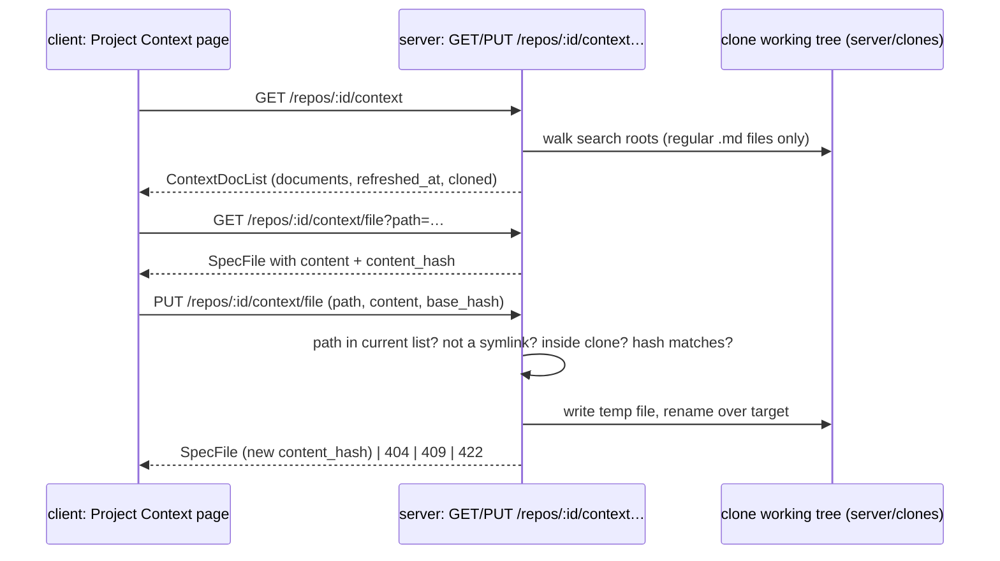

# Spec: Project Context — repository docs page with local edit | Spec ID: SPEC-2026-10-05-project-context-docs | Status: approved
Supersedes: —
Modules: server, client, `@devdigest/shared`
Approved: free3et, 2026-10-05

## Problem and user

A reviewer-agent owner wants to see which markdown specs, docs and insights a
repository already holds, how large each one is in prompt tokens, and fix a
document in place — before attaching documents to agents and skills (that is
[SPEC-2026-10-05-project-context-attach](2026-10-05-project-context-attach.md),
which depends on this spec). Today the studio has no Project Context page and
no server route behind the client hooks that already expect one (see Inputs
and provenance).

## Goals / Non-goals

- **G-1** The server finds every markdown document of a repository under
  configurable search roots and reports its type and approximate token size.
- **G-2** A Project Context page, reachable from the sidebar, lists those
  documents and previews one as rendered markdown.
- **G-3** The user can edit a listed document and save it to the repository's
  local clone, safely (no write outside the clone, no partial file, no silent
  overwrite of a newer version).
- **G-4** The user sees the size of the whole set: document count, total
  approximate tokens and when the list was last read.

- **NG-1** No git commit, push or PR is created by an edit; the edit lives only
  in the local clone.
- **NG-2** No Add (new file), Folder, Upload, rename or delete controls.
- **NG-3** No vector indexing, no chunks, no "Indexed … chunks" counter, no
  COVERAGE ring (D-1 elements dropped, C-3, C-5).
- **NG-4** No UI to change the search roots; they are server configuration (C-8).
- **NG-5** Attaching documents to agents/skills, "Used by N agents", run
  injection and trace — all in SPEC-2026-10-05-project-context-attach.
- **NG-6** Resync is not blocked or merged when local edits exist; the user is
  warned instead (C-1).
- **NG-7** `INSIGHTS.md` files outside an `insights/` folder are not matched by
  the default roots (C-10).

## User stories

- **US-1** As an agent owner, I open Project Context for `acme/payments-api`
  and see every spec/doc/insight with its size, so I know what I could attach.
- **US-2** As an agent owner, I fix a wrong invariant in `specs/public-api.md`
  from the page, so the next review uses the corrected text.

## Design references

- **D-1** screenshot (described as text by the main session, seen 2026-10-05):
  Project Context page — sidebar item "Project Context", breadcrumb
  `acme/payments-api > Project Context`, left panel "PROJECT CONTEXT" with root
  label, toolbar (add, folder, upload, refresh), file list, footer
  "Indexed: 12 files · 1,240 chunks, last 5m ago"; right panel with
  Preview/Edit toggle, rendered markdown, "Used by 3 agents", "78 COVERAGE".
- **D-2** text from user (2026-10-05): feature requirements "Project Context
  Folder, step 2 / feature 1" — reader over `specs/`, `docs/`, `insights/`,
  configurable roots, default glob `**/{specs,docs,insights}/**/*.md`, token
  count from MD size.
- **D-3** text from user (2026-10-05): decisions after analysis — edit in scope
  as a plain file write, footer wording, "≈ N tok" on every row.

## Workflow and communication

## Contracts

| Contract | Change | Shape |
|---|---|---|
| `SpecFile` (`@devdigest/shared/contracts/platform.ts`) | changed | existing `path`, `content` (null in list responses), `size` (bytes), `updated_at`; + `doc_type`: one of `specs` / `docs` / `insights`; + `approx_tokens`: integer, `ceil(characters / 4)` of the file content; + `content_hash`: string, nullable (sha256 hex of the content; null in list responses) |
| `ContextDocList` (`@devdigest/shared/contracts/platform.ts`) | new | response: `documents`: `SpecFile[]` sorted by `path`; `refreshed_at`: ISO timestamp of this read; `cloned`: boolean (false = the repo has no local clone, `documents` is empty) |
| `ContextDocWrite` (`@devdigest/shared/contracts/platform.ts`) | new | request: `path`: repo-relative string; `content`: string, at most 262 144 bytes UTF-8; `base_hash`: string (the `content_hash` the client last loaded) |
| `GET /repos/:id/context` → `ContextDocList` | new route | — |
| `GET /repos/:id/context/file?path=` → `SpecFile` | new route | `content` and `content_hash` filled |
| `PUT /repos/:id/context/file` (`ContextDocWrite`) → `SpecFile` | new route | 404 `path not in the document list`, 409 `content changed since loaded`, 422 validation |
| `IndexStatus`, `POST /repos/:id/context/reindex` | unchanged / not built | Refresh re-reads the list (NG-3); the unused `useReindexContext` hook is not wired |

Wire JSON is `snake_case`. The client copy `client/src/vendor/shared` is
updated after the server copy.

## Acceptance criteria (EARS)

- **AC-1** — WHEN `GET /repos/:id/context` is called for a cloned repo, the
  response SHALL list every regular file (not a symlink) in the clone working
  tree whose repo-relative path matches a configured search root, including
  paths under dot-folders (e.g. `.devdigest/specs/a.md`), and excluding any path
  with a `node_modules`, `.git` or `vendor` segment.
  - Source: G-1, D-2, C-8, C-10
  - Verify: integration (Fastify `inject` over a temp-dir clone fixture with a
    symlinked `.md`, a `node_modules/docs/x.md` and `.devdigest/specs/a.md`)
- **AC-2** — The server SHALL report each listed document with `doc_type` equal
  to the deepest path segment that is `specs`, `docs` or `insights`
  (`docs/specs/x.md` → `specs`) and `approx_tokens` equal to
  `ceil(characters / 4)` of its content.
  - Source: G-1, D-2, C-9, C-11
  - Verify: unit (type + token helper); integration (values in the list response)
- **AC-3** — IF the repo has no local clone, THEN `GET /repos/:id/context` SHALL
  return `cloned: false` with an empty `documents` list, and the page SHALL show
  a "repository not cloned yet" state instead of the list.
  - Source: EC-1, D-1 gap G1
  - Verify: integration (`cloned: false`); component (RTL) — state text visible
- **AC-4** — WHILE a repo is active, the sidebar SHALL show a "Project Context"
  item that navigates to `/repos/:repoId/context`, where the breadcrumb reads
  `<owner>/<name> > Project Context`.
  - Source: G-2, D-1
  - Verify: component (RTL) — nav link href; e2e (flow) — page reachable
- **AC-5** — The Project Context list SHALL show one row per document, sorted by
  path, with file name, folder, a type badge carrying the type as text, and
  `≈ N tok`; a path longer than the row SHALL be cut with an ellipsis and
  exposed in full through the row's `title`.
  - Source: G-2, D-1, D-3, C-12, D-1 gap G3
  - Verify: component (RTL) — order, badge text, `≈ N tok`, `title`
- **AC-6** — The list footer SHALL read
  `N documents · ≈ X tokens total · refreshed <relative time>`, where X is the
  sum of `approx_tokens` of all listed documents and the time comes from
  `refreshed_at`.
  - Source: G-4, D-3, C-5, U-1
  - Verify: component (RTL) — footer text for a 3-document fixture
- **AC-7** — WHEN the user activates Refresh, the page SHALL re-request the list
  and replace rows, footer total and refreshed time with the new response.
  - Source: G-4, D-1, C-3
  - Verify: component (RTL) — second fetch, new footer
- **AC-8** — WHEN the user selects a document, the page SHALL show its content
  rendered as markdown in Preview mode, with raw HTML in the file shown as text,
  never executed or rendered as elements.
  - Source: G-2, D-1, D-1 gap G4
  - Verify: component (RTL) — heading rendered; `<script>`/`` in
    content produce no element
- **AC-9** — IF the list or file request fails, THEN the page SHALL show an
  inline error with a Retry control; IF the repo has zero matching documents,
  THEN it SHALL show the empty state naming the search roots.
  - Source: EC-2, EC-3, D-1 gap G1
  - Verify: component (RTL) — both states
- **AC-10** — WHEN the user saves an edit, `PUT /repos/:id/context/file` SHALL
  replace the file in the clone working tree with the submitted content, and a
  following `GET …/file` SHALL return that content and a new `content_hash`.
  - Source: G-3, US-2, C-1
  - Verify: integration (temp-dir clone; bytes on disk equal the body)
- **AC-11** — IF a `GET …/file` or `PUT …/file` names a path that is not in the
  repo's current document list — absolute, containing `..`, `\` or NUL, inside
  `.git`, a symlink, or whose real parent folder resolves outside the clone —
  THEN the server SHALL answer 404 and SHALL NOT read or write any file.
  - Source: G-3, C-2, EC-4, EC-5
  - Verify: integration — one case per kind, including a symlinked folder
    pointing outside the clone; the outside target is unchanged
- **AC-12** — IF writing the new content fails part-way, THEN the original file
  SHALL be unchanged and no temporary file SHALL remain in its folder.
  - Source: G-3, C-2
  - Verify: unit (writer with an injected failure after the temp write)
- **AC-13** — IF `base_hash` differs from the hash of the file currently on disk,
  THEN `PUT …/file` SHALL answer 409 without writing, and the page SHALL show an
  inline conflict message with a Reload control.
  - Source: G-3, EC-6, C-2
  - Verify: integration (409, file unchanged); component (RTL) — message + Reload
- **AC-14** — IF the submitted content exceeds 262 144 bytes, THEN
  `PUT …/file` SHALL answer 422 without writing.
  - Source: G-3, C-2
  - Verify: integration
- **AC-15** — WHILE the page is in Edit mode, it SHALL show the banner
  "Local edit only — not committed. A repository resync overwrites it.", an
  `unsaved` badge while the text differs from the loaded content, and Save /
  Discard controls.
  - Source: G-3, C-1, NG-6
  - Verify: component (RTL) — banner text, badge toggles, Discard restores

## Edge cases

- **EC-1** Repo imported but clone missing or failed → AC-3.
- **EC-2** API error / clone folder unreadable → AC-9.
- **EC-3** Zero matching documents → AC-9.
- **EC-4** Path traversal or `.git` path in a request → AC-11.
- **EC-5** A committed symlink (`docs/x.md → ~/.devdigest/secrets.json`, or a
  symlinked folder) → excluded by AC-1, refused by AC-11.
- **EC-6** File changed on disk (another tab, resync) after it was loaded →
  AC-13.
- **EC-7** Resync (`git reset --hard origin/<branch>`) after an edit erases it →
  accepted risk, banner AC-15, NG-6 (sync behaviour: see Inputs and provenance).
- **EC-8** 1000+ documents → rendered without pagination (C-12);.
- **EC-9** Non-ASCII content → `approx_tokens` counts characters, not bytes
  (AC-2); `size` stays bytes.

## Non-functional requirements

| ID | Category | Requirement (measurable) | Verify |
|---|---|---|---|
| NFR-1 | performance | `GET /repos/:id/context` p95 ≤ 500 ms for a clone with 20 000 files and 500 matching documents | integration timing on a generated fixture |
| NFR-2 | security | every `/repos/:id/context*` route answers 404 for a repo id outside the caller's workspace | integration |
| NFR-3 | accessibility | rows, Refresh, Preview/Edit toggle, Save, Discard, Retry and Reload are keyboard-reachable with visible focus; icon-only toolbar controls have accessible names; the type badge carries text, not only colour (WCAG 2.2 AA) | component (RTL role/name queries) |
| NFR-4 | observability | a successful `PUT …/file` writes one server log line with repo id, path and new size; never the content | integration (log capture) |

Not relevant: cost (no LLM call), reliability beyond AC-12/AC-13 (read-mostly
view; no background job).

## Inputs and provenance

- Document list, sizes, types, token estimates — `[deterministic: server project-context reader]`
  over the clone at `DEVDIGEST_CLONE_DIR` (`server/README.md:102`), working tree
  on the default branch after the last sync (`server/src/adapters/git/simple-git.ts:84-95`).
- Search roots — `[deterministic: server configuration]`, default
  `**/{specs,docs,insights}/**/*.md` (D-2).
- Content hash — `[deterministic: server]` sha256 of the file bytes.
- Edited content — user input from the page.
- Path safety — `[reused: isSafeRepoPath, clonePathFor checks]`
  (`server/src/adapters/git/simple-git.ts:37-46,161-168`).
- Token estimate rule — `[reused: ceil(chars/4)]` as in
  `client/src/lib/skills.ts:23` (`estimateTokens`) and
  `reviewer-core/src/prompt.ts:164-165` (`approx_tokens`).
- Existing scaffolding this spec fills: client hooks `useContextFiles` /
  `useReindexContext` on `/repos/:id/context` (`client/src/lib/hooks/core.ts:122-137`)
  with no server route behind them; `SpecFile` / `IndexStatus`
  (`server/src/vendor/shared/contracts/platform.ts:254-269`); i18n namespace
  `client/messages/en/context.json`; nav key mapping for `/context`
  (`client/src/components/app-shell/helpers.ts:30`), no nav item yet
  (`client/src/components/app-shell/nav.ts`).
- Resync overwrites the working tree (`git reset --hard origin/<branch>`);
  review runs, reindex and polling only read it (research finding from the
  main session, 2026-10-05; `server/src/adapters/git/simple-git.ts:84-95`).
- No `[new: LLM call]`.

## Untrusted inputs

- **Document content** (repository files, possibly third-party): data only;
  rendered as markdown with raw HTML disabled (AC-8), never as HTML.
- **File and folder names**: rendered as text, truncated with ellipsis (AC-5).
- **`path` request parameter**: accepted only if it is in the freshly computed
  document list and passes the symlink/real-path checks (AC-11).
- **Committed symlinks** in the clone: never followed for read or write (AC-1,
  AC-11).
- **Edited content**: written as-is; size-capped (AC-14); never executed.

## Traceability

| Source | Covered by |
|---|---|
| G-1 | AC-1, AC-2 |
| G-2 | AC-4, AC-5, AC-8 |
| G-3 | AC-10, AC-11, AC-12, AC-13, AC-14, AC-15 |
| G-4 | AC-6, AC-7 |
| US-1 | AC-4, AC-5, AC-6 |
| US-2 | AC-10, AC-15 |
| D-1 gap G1 (missing states) | AC-3, AC-9 |
| D-1 gap G2 (chunks / coverage have no data) | NG-3 |
| D-1 gap G3 (long paths, volume) | AC-5, EC-8 |
| D-1 gap G4 (markdown from repo) | AC-8 |
| D-1 gap G14 (i18n keys) | AC-3…AC-15 (every visible string is an i18n key in the existing `context` namespace) |
| D-1 gap G15 (badge consistency) | AC-5 (shared with attach spec AC-1) |
| D-1 gap G16 (reuse `@devdigest/ui`, a11y of `Toggle`) | NFR-3 |
| D-1 Add/Folder/Upload, COVERAGE, chunks | NG-2, NG-3 |
| U-1 (accepted, user wording) | AC-6 |
| EC-1 | AC-3 |
| EC-2, EC-3 | AC-9 |
| EC-4, EC-5 | AC-1, AC-11 |
| EC-6 | AC-13 |
| EC-7 | AC-15, NG-6 |
| EC-8 | |
| EC-9 | AC-2 |

## Clarifications

- **C-1** 2026-10-05 · Is editing on the page in scope? → Yes: Edit is a plain
  file write into the clone's `.md`, no git/push/LLM; warn that a resync can
  overwrite it. (user)
- **C-2** 2026-10-05 · How is the write made safe? → Only listed files; path
  checks; no symlink on read or write; atomic temp-file + rename; 256 KB cap;
  409 on `base_hash` mismatch. (user accepted the analysis defaults)
- **C-3** 2026-10-05 · Which D-1 controls are in scope? → Refresh and
  Preview/Edit; Add, Folder, Upload, COVERAGE, chunks are not. (user)
- **C-4** 2026-10-05 · Where are documents read from? → The clone working tree,
  freshly on every request. (user)
- **C-5** 2026-10-05 · Footer wording? → "N documents · ≈ X tokens total ·
  refreshed Xm ago". (user)
- **C-6** 2026-10-05 · Simplest implementation wherever requirements are silent.
  (user)
- **C-7** 2026-10-05 · Split into two specs (docs/page/edit vs
  attach/run/trace)? → Yes. (user)
- **C-8** 2026-10-05 · Where are search roots configured? → Server
  configuration with the default glob; no UI. (user accepted default)
- **C-9** 2026-10-05 · Token count method? → `ceil(chars / 4)`, computed by the
  server, the same estimate the skill editor and the prompt manifest already
  use (see Inputs and provenance). (user accepted default)
- **C-10** 2026-10-05 · Dot-folders and `INSIGHTS.md`? → Dot-folders included;
  `node_modules`, `.git`, `vendor` excluded; `INSIGHTS.md` not added. (user
  accepted default)
- **C-11** 2026-10-05 · Type when a path holds several roots? → Deepest
  matching segment. (user accepted default)
- **C-12** 2026-10-05 · Sort and volume? → By path, no pagination, ellipsis
  for long paths. (user accepted default)
- **C-13** 2026-10-05 · Show "≈ N tok" on every row? → Yes. (user)
- **C-14** 2026-10-05 · NFR-1 numbers (20 000 files / 500 documents / p95 ≤ 500 ms)?
  → Accepted as proposed. (user approved the spec)

## Open questions

None — the former N-1 is resolved as C-14.
